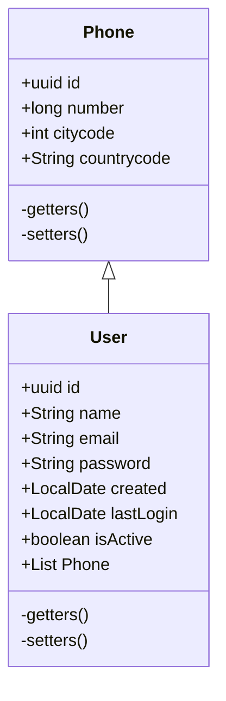

# Construcción
El microservicio se construyó con Spring Boot, se utilizó [Spring Initializr](https://start.spring.io) y se seleccionaron las siguientes opciones:
* Project type: Gradle
* Language: Java
* Packaging: jar
* Java version: 8
* Spring Boot: 3.1.14

Y se usaron las siguientes dependencias:
* **Web**: Spring Web
* **Validation**: Bean Validation
* **H2 Database**: H2 Database
* **Spring Data JPA**: Spring Data and Hibernate
* **Lombok**

